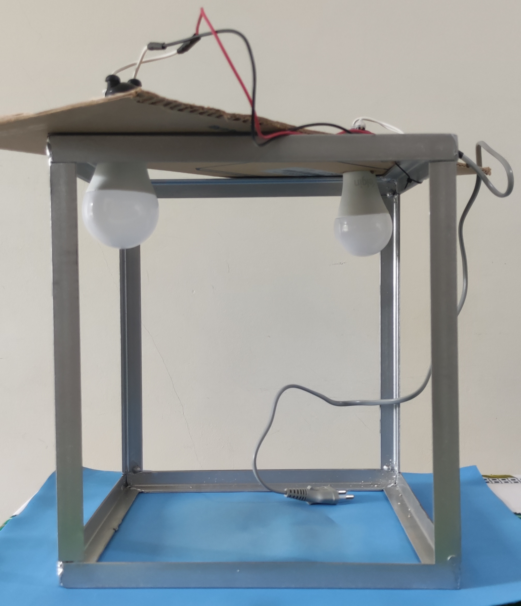
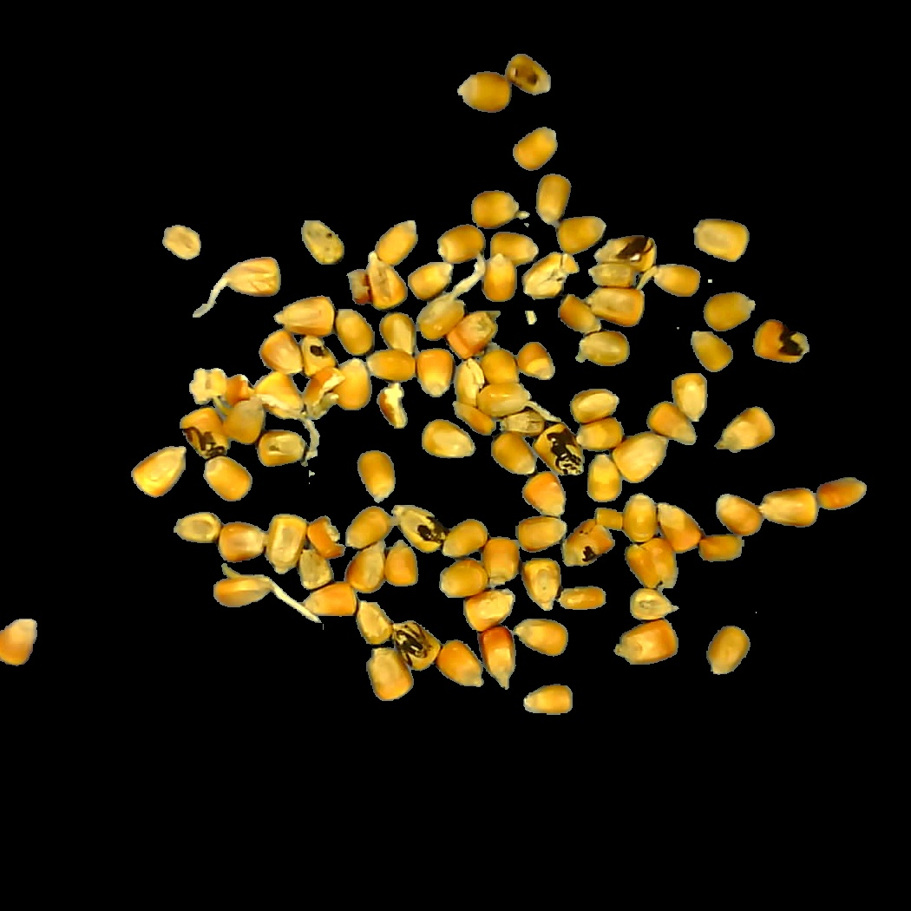
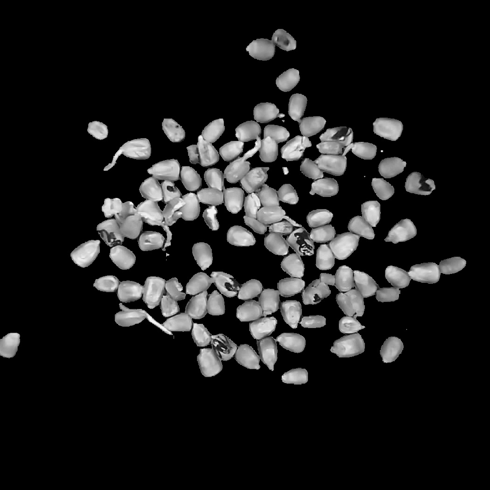

# Classificação de defeitos em amostras de grãos de milho Zea Mays

Bem-vindo ao nosso repositório que aborda a classificação de grãos de milho utilizando PDI. Este repositório contém scripts, notebooks, um dataset e um código para aquisição de imagens utilizando um módulo ESP-32 CAM.

## Descrição
Este projeto utiliza técnicas de processamento digital de imagens para a classificação de grãos de milho da espécie Zea Mays por meio da coloração dos grãos.

## Conteúdos

- Scripts: Contains Python scripts for data preprocessing, model training and evaluation.
- Notebooks: Jupyter notebooks for exploratory data analysis, model development and data visualization.
- Data: The directory where the datasets used in this project are stored.

## Getting Started

### Obtenção das imagens para o [dataset](img/dataset/)

As imagens ilustram o disposito de aquisição, sendo que os grãos sãos inseridos sobre o plano de fundo azul e o microcontrolador na parte superior captura a imagem a cada novo comando vindo por meio da Comunicação Serial.

As dimensões da caixa são 30x30x30 cm, são utilizadas duas lâmpadas LED de 12 W para o sistema de iluminação.

    <figure>
        <figcaption><strong>Front View Setup</strong></figcaption>
        
    </figure>
    <figure>
        <figcaption><strong>Top View Setup</strong></figcaption>
        
    </figure>

O código a ser carregado para o ESP-32 CAM é [aquisition_device](src/aquisition_device/).

### Pré-processamento

Após obter as imagens das amostras, é aplicado o pré-processamento o qual prepara e rotula as imagens para a etapa de criação de modelos e da classificação. Na sequência são apresentadas as imagens resultantes do pré-processamento, sendo a imagem grayscale utilizada para a classificação.

<!-- 

    <figure>
        <figcaption><strong>RGB example</strong></figcaption>
        
    </figure>
    <figure>
        <figcaption><strong>Grayscale example</strong></figcaption>
        
    </figure>

 -->

    <figure>
        <figcaption><strong>RGB example</strong></figcaption>
        
    </figure>
    <figure>
        <figcaption><strong>Grayscale example</strong></figcaption>
        
    </figure>

## Installing

### Dependencies
- Python 3.7+
- NumPy
- Pandas
- Scikit-learn
- Matplotlib
- Plotly
- Seaborn
- OpenCV
- Pandas
- Numpy

> You can install any missing dependencies with pip.

Clone the GitHub repository and install the dependencies.

bash
Copy code
git clone https://github.com/username/repo_name.git
cd repo_name
pip install -r requirements.txt
Executing Program
Run the scripts in the Scripts directory for data preprocessing and model training.
Jupyter notebooks can be run in JupyterLab or Jupyter Notebook.
bash
Copy code
jupyter notebook
Then navigate to the Notebooks directory.

### Contributing
We would love your contributions! Please read CONTRIBUTING.md for details on our code of conduct, and the process for submitting pull requests.

### License
This project is licensed under the MIT License - see the LICENSE file for details.
